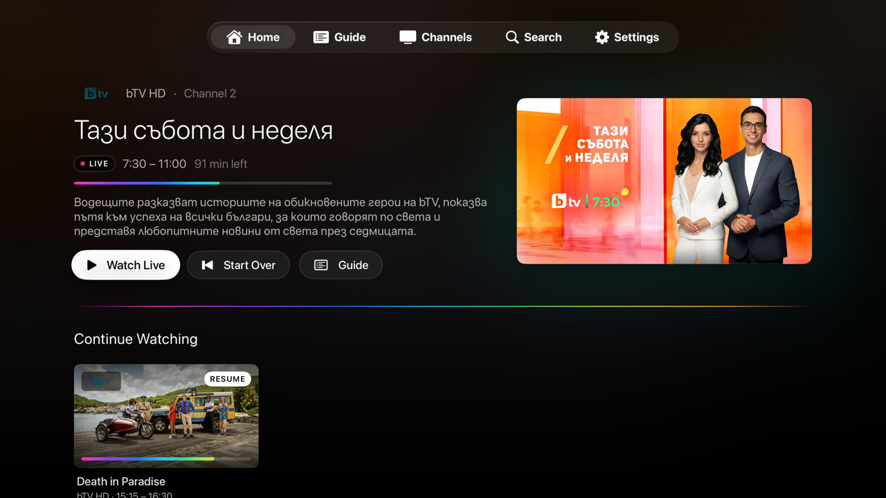
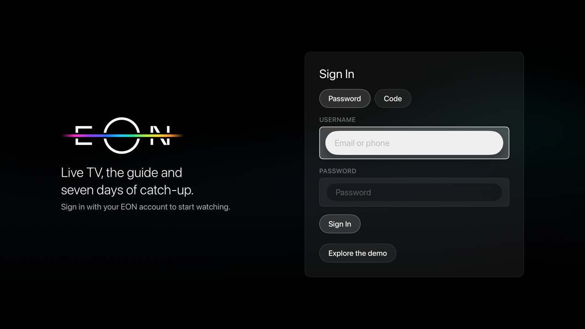
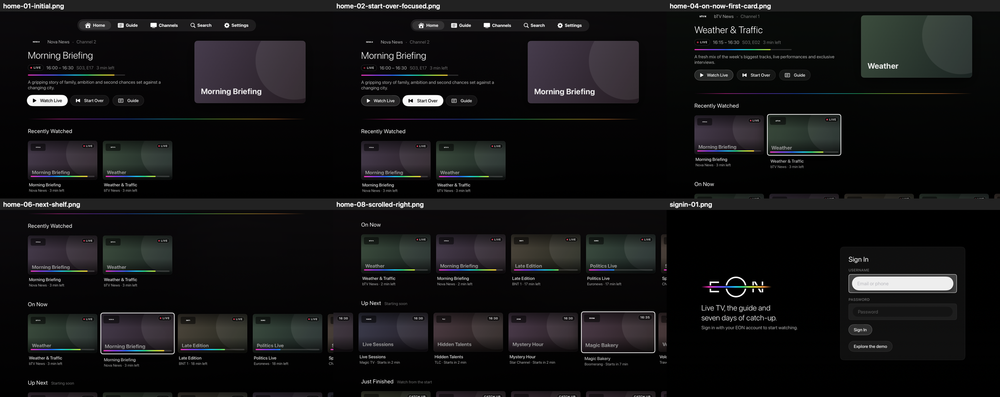
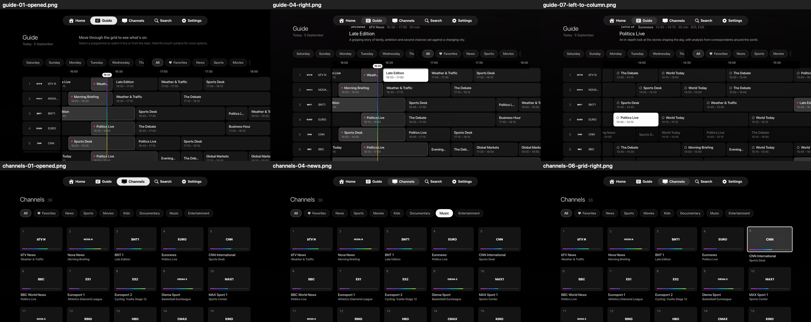
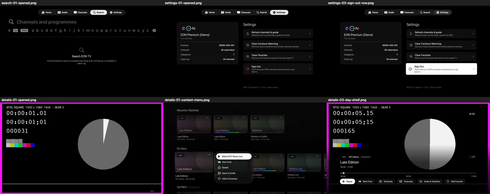

# EON TV for Apple TV

A native tvOS Internet TV application built on the EON platform SDK that lives in
`EON_TV/Core`, `EON_TV/Data` and `EON_TV/Domain`. Live channels, a remote-first programme
guide, catch-up and start-over playback, favourites and continue watching, all driven by the
platform's live clock so the interface stays current without reloading screens.

## Screenshots

<p align="center"></p>

<p align="center"></p>

<p align="center"></p>

<p align="center"></p>

<p align="center"></p>

## Why this exists

EON does not ship an Apple TV app. There is no official tvOS client, so on an Apple TV the
only options are AirPlay from a phone or a browser on another device. This project fills that
gap with a native tvOS client for people who already pay for the service.

## Disclaimer

This is an unofficial, community project. It is **not** official and it is **not** associated
with, endorsed by, or supported by EON TV, United Group, or any of their subsidiaries. All
trademarks belong to their owners.

**A user account with a paid subscription is required.** This app is only a client: it does not
provide, host, decrypt, or unlock any content, and it grants no access you do not already have.
Without valid EON credentials and an active subscription, nothing plays.

## Credits

The EON platform API surface used here was mapped out by
[nirvana-7777/pvr.eon](https://github.com/nirvana-7777/pvr.eon), the Kodi PVR add-on for EON.
That project's work on the endpoints, the device registration flow and the timeshift URL
scheme is what made this client possible. Thank you.

## Requirements

- Xcode 26 or later (built and tested with the tvOS 27 SDK).
- Deployment target tvOS 26.0. No third-party dependencies.
- No signing team is committed. Pick your own team under **Signing & Capabilities** before you
  build on a device.
- Client credentials are not committed. Copy `Secrets.example.swift` to
  `EON_TV/Core/Secrets.swift` and fill in the four values before you build. That path is
  gitignored, and CI writes it from repository secrets.

## Credentials

The app talks to the EON platform as one of EON's own OAuth clients, so it needs a client id
and client secret for each. These are not in the repository. Provide them one of two ways.

**Locally** – copy the template and fill it in:

```
cp Secrets.example.swift EON_TV/Core/Secrets.swift
```

**In CI** – set these four repository secrets under *Settings → Secrets and variables →
Actions*, and the build workflow writes the file for you:

| Secret | Holds |
| --- | --- |
| `EON_ANDROIDTV_CLIENT_ID` | Android TV client id |
| `EON_ANDROIDTV_CLIENT_SECRET` | Android TV client secret |
| `EON_WEB_CLIENT_ID` | Web client id |
| `EON_WEB_CLIENT_SECRET` | Web client secret |

Note that a client secret shipped inside an app is not really secret: it is in the binary and
can be read out of it. Keeping it out of the repository is hygiene, not protection. These
particular values belong to EON's published clients, not to you, and they unlock nothing on
their own — playback still needs your own account and subscription.

## Running

1. Open `EON_TV.xcodeproj` and run the `EON_TV` scheme on an Apple TV simulator or device.
2. Sign in with an EON account, either with a username and password or with a one-time code:
   the app shows a six-character code that you confirm in the EON portal under Devices, and it
   signs in by itself once the code is accepted. On first use the app registers this Apple TV
   with the platform under a serial it mints once and keeps in the keychain, so reinstalls
   and sign-outs never create extra devices on the household. Tokens and the device
   registration are kept in the keychain; the app resumes the session on the next launch and
   refreshes tokens transparently.

In Debug builds a fixture-backed **demo mode** is available so the interface and player can be
explored without a subscriber account: choose **Explore the demo** on the sign-in screen, or
launch with the `-demo` argument. Demo playback uses Apple's public HLS sample stream.

## What the app offers

- **Home** – a hero that follows the focused card, then shelves derived live from the guide:
  Continue Watching, Recently Watched, On Now, Favorites, Up Next, Just Finished and one shelf per
  channel category. Cards show channel, live badge or start time and airing progress.
- **Guide** – a full-day grid with a pinned channel column and time ruler, a live "now" line, a
  header that describes whatever is focused, day and category chips, and progressive loading of
  guide chunks as rows come into view. Select plays live or from the start; a long press offers
  the full set of actions.
- **Channels** – the line-up as tiles by category or favourites, with what's on and progress.
- **Search** – client-side search across channels and every loaded guide day, grouped into
  On Now, Catch Up and Coming Up.
- **Player** – a custom transport designed for this platform's streams. EON's live and
  timeshift playlists have no seekable window, so the player never scrubs in-stream: the
  timeline is programme-based (position inside the current programme, the live edge, a ghost
  marker while skipping) and every move is a fresh timeshift request at a wall-clock instant.
  Skip back/forward in fixed 15-second steps or slide across the touchpad to scrub (one full
  slide covers a fifth of the programme; commit after a short pause or with select), pause and
  resume exactly where you paused, Start Over and Go Live, a Schedule panel to jump to earlier
  programmes, a Channels panel to switch, an Audio & Subtitles panel, favourite toggle, retry on
  failure, and Back that hides controls first and then leaves.
- **Settings** – household details, refresh, clearing local data and sign-out.

## Design

The look comes from the EON mark: a black canvas, thin white geometric letterforms and one
horizontal spectrum line that cuts through them.

- **Canvas** – pure black, with only a faint blurred trace of the featured artwork behind a
  screen. Surfaces are near-black greys with hairline strokes; there is no tinted accent.
- **Type** – the tvOS text styles (title2 for the hero, title3 for screen titles, callout for
  shelf titles, caption and caption2 for card copy), so every label follows the viewer's Text
  Size setting, which tvOS 27 made system-wide. Regular weight for display text, medium only
  where text must be read at a glance; small labels are uppercase with wide tracking and never
  drop below the platform's 23-point minimum. Nothing is heavy, and nothing is light.
- **Spectrum** – the line is the only colour in the system. Every progress bar is a reveal of
  the spectrum fixed to the track, the guide's "now" marker is a vertical run of it, loading
  states are a piece of the line travelling along a track, and a faded rule separates the hero
  from the shelves. Live television keeps one extra saturated cue: a small red dot.
- **Aurora** – the atmosphere behind the black: luminous wave bands in teal, violet and deep
  blue. `AuroraGeometry` describes a band once; `AuroraWaves` draws it blurred into a single
  layer, `DriftingAurora` slides that layer slowly behind every screen with a Core Animation
  transform (so the motion runs in the render server, not on the main thread), artwork
  placeholders show a still of it varied per channel, channel tiles carry a near-black tint from the same palettes, and the demo
  posters are rendered from the same maths in CoreGraphics. Focused artwork gets a soft teal
  halo, the one place the aurora's light touches the interface itself.
- **Navigation** – the top-level sections live in the system sidebar (`TabView` with the
  `.sidebarAdaptable` style): a floating Liquid Glass panel that collapses to a slim indicator
  while you are inside a section, with Search pinned by its role. On tvOS 27 the sidebar also
  carries the EON mark as its header and the household's package as its footer. Content runs
  edge to edge beneath it, so the ambient backdrop and hero artwork continue under the glass.
- **Controls** – buttons, chips, settings rows and text fields are the system's Liquid Glass
  controls (`.glass`, `.glassProminent`, the default text field), tinted white, so focus lifts
  and lights them exactly as it does across tvOS 26 and later. Only content keeps a custom focus
  treatment built on the standard focus APIs: artwork cards scale and glow, guide cells turn into
  a white platter. Selection at rest (a chip's filter, the sign-in method) is heavier type with a
  short run of the spectrum, never colour.
- **Text size** – layouts adapt rather than truncate. Artwork grows with its caption up to 1.6×,
  the channel grid drops columns as tiles widen, the guide's rows, column and hour width scale
  together, and at accessibility sizes the hero, details, sign-in and settings screens stack
  vertically, captions may take two lines and the player's control row shows symbols only.
- **Calm interface** – when Reduce Motion is on, or tvOS 27 reports that the system prefers
  reduced resource usage, the aurora stops drifting, skeletons stop shimmering, the live badge
  stops breathing and the blurred artwork behind screens is skipped.
- **Mark** – `BrandGeometry` describes the letterforms, slice and line once in cap-height units.
  `BrandMark` draws it in SwiftUI (the launch screen animates the line in), and
  `Tools/BrandAssets` renders the layered App Icon (black back, line in the middle, letters in
  front, so parallax moves the line through the letters) and the Top Shelf images from the same
  geometry:

  ```bash
  swiftc -O Tools/BrandAssets/main.swift EON_TV/Design/BrandGeometry.swift -o /tmp/genassets && /tmp/genassets "EON_TV/Assets.xcassets/App Icon & Top Shelf Image.brandassets"
  ```

## Architecture

```
EON_TV/
  Core, Data, Domain      SDK: networking, interceptors, token store, services, repositories
  Domain/AppExtensions    Crash-safe accessors and capability checks over the SDK models
  App/                    Composition root (Backend), session lifecycle, root view, demo fixtures
  State/                  ContentStore (line-up + guide), LiveClock, favourites, history, images
  Design/                 Theme tokens, focus-aware button styles, badges, skeletons, artwork
  Features/               Home, Guide, Channels, Search, Settings, Player, Auth, tab shell
EON_TVTests/              Unit tests for derived shelves, search, catch-up and history rules
EON_TVUITests/            Remote-driven walkthroughs that screenshot every focus step
```

Key decisions:

- `Backend` wires the SDK exactly as intended: broker client token → CDN info → the `vivacom`
  entry's API host → services → repositories, with the auth interceptor added before the cache
  interceptor so only authorised payloads are cached. The API host is cached for fast launches.
- Device identity lives in `DeviceStore`: a UUID serial minted once, plus the `deviceId`,
  `deviceNumber` and `friendlyId` the platform issued for it. `AuthRepositoryImpl` registers the
  device (client token → `POST v1/devices`) before the first grant, re-registers once with the
  same serial if the platform reports the device unknown, and `clearSession` drops the
  registration but never the serial. The device number feeds every token grant and the
  encrypted stream request; a stored session without a registration counts as signed out.
- Two client identities (`ClientIdentity`): the Android TV client registers the device, requests
  codes and performs the OTP grant, so the portal lists this Apple TV as a TV box; the Web
  client performs the password grant, the only grant it is allowed. `AppSession` polls the OTP
  grant every five seconds while the code is valid (`GET v1/otp` issues the code; the grant
  answers 401 until the viewer confirms it in the portal). The issuing client is stored with the
  tokens so a refresh goes through the same one. A password sign-in therefore appears as a web
  session in the portal even though the device itself is registered as a TV box.
- `ContentStore` loads the guide in stable chunks of the default channel order (so the SDK's
  URL-keyed cache keeps hitting), derives every shelf from `LiveClock`, and publishes only when
  results change so cards keep identity, scroll position and focus.
- Favourites, recently watched channels and catch-up resume positions are local: the platform
  exposes no APIs for them.
- The player anchors the playhead to wall-clock time so the timeline, resume positions and
  the current programme follow the viewer across programme boundaries on continuous streams.
  While a timeshift stream is still loading, the playhead reports the instant that stream was
  requested at, so the programme shown, the timeline and any further skips reason from where
  the viewer chose to be rather than from the live edge.
- Screens rebuild as little as possible on a focus move: shelves and guide rows compare equal
  when their content is unchanged (`.equatable()`), the hero and the blurred backdrop follow
  focus only once it rests, artwork already in the memory cache paints on a card's first frame,
  and skeletons, glows and shadows exist only where they are visible.
- The guide builds only the programme cells near the viewport. Every cell is a focusable button
  with a context menu, and SwiftUI's per-update cost (attribute graph, layout, focus and gesture
  responder walks) grows with the number of live cells, so a row materialises the hours on
  screen plus an hour either side (`GuideScrollState.window`, moved in whole hours so rows
  re-evaluate a couple of times per screen of scrolling) and one neighbour beyond that, so focus
  can always step off the edge however long a programme is. The rest of the day is empty space
  at the right offsets. Nothing in SwiftUI animates continuously: the aurora's drift is a Core
  Animation transform, because a SwiftUI animation keeps the display link firing and the whole
  screen redrawing on every frame for as long as it runs.
- Remote model in the player: select shows controls · play/pause toggles · left/right skip ·
  down opens the schedule · up opens channels · Back cancels a skip, hides controls, then exits.
- Back in the player is caught at the UIKit level (`BackInterceptingHost`), not only through
  SwiftUI's `onExitCommand`. tvOS delivers a keyboard Escape (Simulator keyboard, Bluetooth
  keyboards) as a keyboard press rather than a Menu press, so SwiftUI ignores it and the
  enclosing full-screen cover would dismiss the whole player; the interceptor turns both kinds
  of press into the same panel → controls → exit ladder.

## Testing

Run the whole suite on an Apple TV simulator:

```bash
xcodebuild test -project EON_TV.xcodeproj -scheme EON_TV -destination 'platform=tvOS Simulator,name=Apple TV 4K (3rd generation)'
```

The UI tests launch the demo, drive the Siri Remote through Home, Guide, Channels, Search,
Settings, details, context menus and the player (sections are reached through the sidebar:
left from the first control opens it, up/down picks a section, right returns to content), and
attach a screenshot after every step
(export them with `xcrun xcresulttool export attachments`). To run the same walkthrough with
Large Text, pass a content size category through the test runner's environment:

```bash
TEST_RUNNER_EON_TEXT_SIZE=UICTContentSizeCategoryAccessibilityL xcodebuild test -project EON_TV.xcodeproj -scheme EON_TV -destination 'platform=tvOS Simulator,name=Apple TV 4K (3rd generation)' -only-testing:EON_TVUITests/RemoteWalkthroughTests
```

`GuidePerformanceTests` is for measuring rather than checking: `testGuideNavigationCPU`
reports the app's CPU time for twenty presses around the guide (compare it before and after a
change), `testGuideNavigationSweep` and `testGuideIdle` keep the guide busy or still for long
enough to profile the app with `sample EON_TV 25` or Instruments attached to the simulator.

The app itself accepts the same override for a quick look:
`-UIPreferredContentSizeCategoryName UICTContentSizeCategoryAccessibilityXXXL` as a launch argument. `RealSessionPlaybackTests` drives
the player against real streams and skips itself unless the simulator is already signed in.
`CodeSignInTests` does the opposite: on a signed-out simulator it switches the sign-in screen
to the code option, which registers the device and requests a real code from the platform,
and checks that the app keeps waiting while the code is unconfirmed.

## SDK changes

Small fixes were made to the SDK sources:

- `Schedule.hash(into:)` hashed nothing; it now combines id, start and end.
- `StreamingRepositoryImpl` guards the hard-coded server index instead of crashing on a short list.
- `CacheInterceptor` no longer stores non-2xx responses.

Device registration replaced a hard-coded device number:

- `Constants.deviceId` is gone. `DeviceStore` (Core) persists the serial and registration and
  `DeviceService` (Data) calls `v1/devices` and `v1/otp` on the regional host with the client
  token. The old `ConfigService.registerDevice` posted to `v3/devices`, which the platform now
  answers with 403, and used `identifierForVendor` as the serial; it was removed.
- `LoginService` gained the OTP grant, and both grants plus refresh map the platform's error
  bodies to `AuthError` (bad credentials, unregistered device, unconfirmed code, expired
  session) instead of a generic decoding error.
- `AccessToken` treats everything but `access_token` as optional; a refresh may omit the refresh
  token and stream fields, and the stored values are kept in that case.
- `AuthRepository` gained `requestOneTimeCode`, `login(oneTimeCode:)` and `registeredDevice`.
- `StreamingRepositoryImpl` takes the device number from `DeviceStore`.

## Assumptions and known limits

- `Channel.cutvDelay` has no documented unit; the catch-up window is normalised heuristically
  (days, hours, minutes, seconds or milliseconds) and defaults to seven days. Requests outside the
  real window fail gracefully with a message.
- Channels flagged `drmRequired` are attempted like any other; the SDK has no key-server flow, so
  a failure shows a specific explanation.
- Real streams were verified on a signed-in simulator. Note that the app must be code-signed
  (as Xcode does automatically) for the keychain, and therefore sign-in, to work in the simulator;
  builds made with `CODE_SIGNING_ALLOWED=NO` cannot persist tokens.
